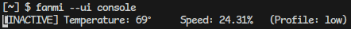

# fanmi - Linux AMD GPU Fan Control

Inpired by [amdgpu-fancontrol](https://github.com/grmat/amdgpu-fancontrol), but I wanted a UI.

My Vega56 automatic fan control under linux runs way to hot and radeon-profile for some reason segfaults on my machine, so I used [amdgpu-fancontrol](https://github.com/grmat/amdgpu-fancontrol), which worked like a charm, but I wanted the following features:

- GUI
- SUID root for the executable so I can start it without using sudo

Also, I wanted to learn a new GUI-Framework with a simple project, that's why this one uses [fyne](https://fyne.io/).

| GUI | Terminal |
|-|-|
|  |  <hr> |


## Getting started

- Download the latest release binary or compile it yourself.
- (optional) Make the binary launch as root without sudo (`sudo chown root:root ./fanmi && sudo chmod u+s ./fanmi`)

## CLI Use

You can have three UI-options:

1. `--ui graphic` - GUI - (Default) Shows a window with temperature, fan-speed and option to switch on/off
2. `--ui console` - Console - Prints out temperature and fan-speed on the console - press space to switch on/off
3. `--ui none` - No output

If you want to change the fan-curve, you can create a configuration file in JSON.
Either provide the path to the file as CLI-argument (`--config "path/to/config.json"`), or put it at the default location, which you can find by invoking fanmi with `--help`.

The default configuration would look like this:

```json
{
    "checkIntervalMs": 3000,
    "minChange": 2,
    "values": [
        {
            "Temp": 40,
            "Speed": 0
        },
        {
            "Temp": 60,
            "Speed": 0.2
        },
        {
            "Temp": 80,
            "Speed": 0.5
        },
        {
            "Temp": 85,
            "Speed": 0.7
        },
        {
            "Temp": 90,
            "Speed": 1
        }
    ]
}
```

### Exit codes

In addition to printing the error message to stderr, the application exits with an exitcode describing the problem:

| Code | Description |
|-|-|
| 1 | Could not open device |
| 2 | Could not find decive |
| 3 | Could not find at least one compatible device |
| 4 | Could not determine current user |
| 5 | You do not have (effective) root permissions |
| 6 | Could not read temperature |
| 7 | Could not write to file |
| 8 | Could not write fan speed |
| 9 | Could not read fan speed |
| 10 | Could not find user config directory |
| 11 | Could not read configuration file |
| 12 | Could not parse configuration file |

## ToDos & Planned Features

- The Configuration should be editable in the GUI
- A graphic representation (chart) of the fan curve
- Minimize to systray (this is supported by fyne, but does not work on my system)
- Autostart feature (maybe this should just be part of the documentation)
